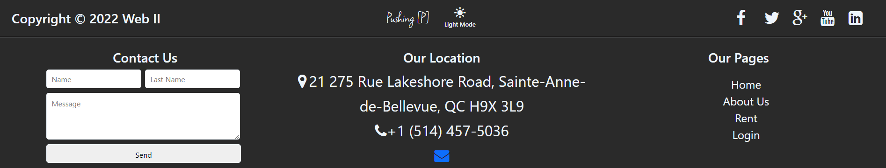
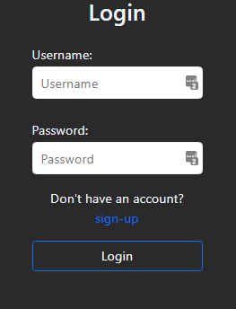
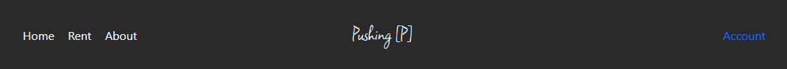
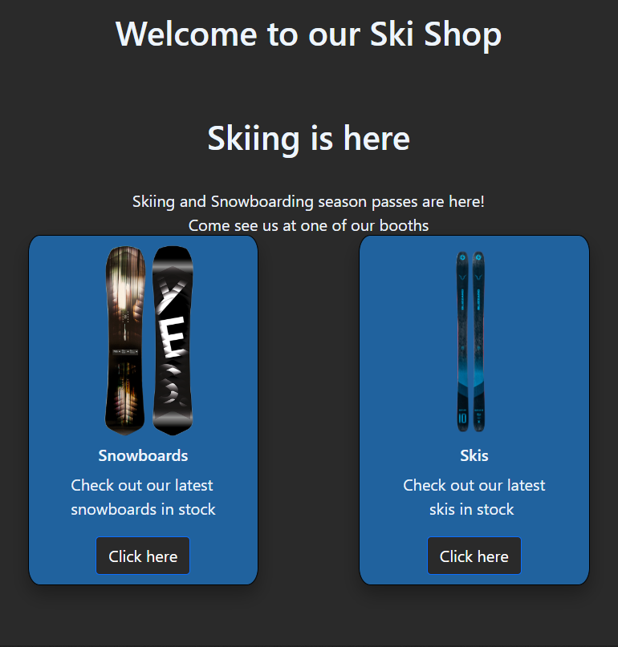
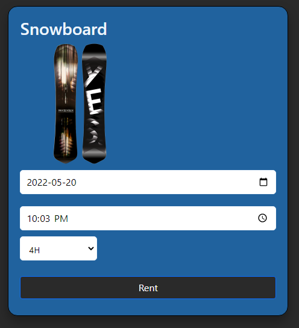
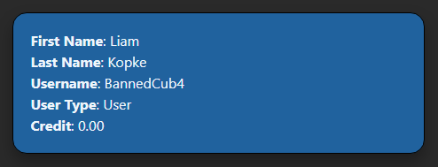
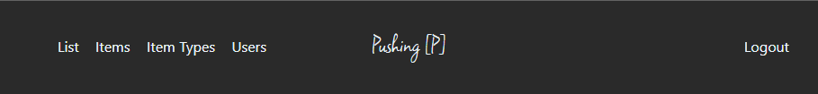

# Rental Ski Shop

Eric, Liam & Pleasure

Made by Liam

## Table Of Contents

1. [**Shared**](#Shared)

   - [**Header**](#Header)
   - [**Footer**](#Footer)
   - [**Login**](#Login)
   - [**Logout**](#Logout)
   - [**Personalization**](#Personalization)

2. [**User**](#User)

   - [**User Header**](#User-Header)

   - [**User Footer**](#User-Footer)

   - [**Home Page**](#Home-Page)

   - [**Rentals Page**](#Rentals-Page)

   - [**About Us**](#About-Us)

   - [**Login**](#Login)

   - [**Account**](#Account)

   - [**Sign Up**](#Sign-Up)

3. [**Admin**](#Admin)

   - [**Admin Header**](#Admin-Header)
   - [**Admin Footer**](#Admin-Footer)
   - [**List**](#List)
   - [**Items**](#Items)
   - [**Item Types**](#Item-Types)
   - [**Users**](#Users)

## Shared

#### Header

We have two different headers to better display, both of which have our logo, which redirects the user back the our [home page](#Home-Page)

#### Footer

Our footer allows the user to know more about us, contact us or access the different parts of the site.

**Personalization**: Dark Mode / Light Mode switch

**Socials**: Links to our other platforms

**Contact Us**: Sends an email to the dev team

**Location**: Address where people can come see us

**Pages**: Links to all the pages of our site depending on the logged in users' type. Changes depending on which user is logged in. 

[Admin](#Admin-Footer): 

[User](#User):

#### Login

The login page allows the user to log in to their account.

The site verifies that the inputted credentials match those stored in the database.

Any error is displayed over the form.

Once a user is logged in, the header will display [account](#Account) instead of login

#### Logout

Allows a user to logout. This clears all session cookies.

[Users](#User) will find this feature in the [Account](#Account) page whilst [Admins](#Admin) will find it instead of the [Account](#Account) page

#### Personalization

In the [footer](#Footer), a Dark Mode / Light Mode button can be found that switches the theme of the site. This choice is saved as a cookie so that the choice is constant across all pages.

## User

#### User Header

Our header allows the user to access all the pages they have access to. 

[**Home Page**](#Home-Page): Call to actions to all parts of our site

[**Rentals Page**](#Rentals-Page): The core reason for our site

[**About Us**](#About-Us): Information about our team to make the site feel more human

**User Pages**:
  1. [**Account**](#Account): Displays account information
  2. [**Login**](#Login): Allows the user to log in or sign up

#### User Footer

Only difference from main [footer](#Footer) is that the links are for the same as the same as in the [user header](#User-Header)

#### Home Page

Our home page is the core of our site. It prompts the user to rent or learn more about us. 

Its features are as follows:

1. Hero Image

   - Prompts the user to rent now

2. Welcome Message

   - Makes the user feel invited to the site

3. Rental examples

   - Forces the user to see our rentals

4. Sneak Peak at the about us

   - Makes our site feel more human

5. Locations

   - Added for flare

#### Rentals Page

The page allows a user to rent an item from our inventory.

In order to access this page, the user must be logged in from the [login](#Login) page. 

Once inside, the user can expect to find two categories of items. Items related to skiing and items related to snowboarding. These two categories of items are split down the middle with the left pertaining to the former and the right the latter. 

Once the user picks the item they wish to rent, they just have to fill out the form and select the rent button.

The rental forms is as follows:

- Date
  - The user has to input a date
  - This is limited so that the date cannot be smaller than current date
- Time
  - The user has to input a time
  - Duration is picked from a dropdown
    - 4 hours
    - 8 hours
  - The time is limited so that a rental can only occur within operating hours
    - Depending on the duration of the rental, the maximum time changes to:
      - 4 hours: 18:00
      - 8 hours:  14:00
    - 08:00 being opening time
    - 22:00 being closing time

- Submit

  - If all of the fields are valid, then the site makes a request to the server.

  - The model checks that all the fields are good.

  - If all the fields are good, it checks if there is a matching item available at that time

  - If an item is found, it creates the rental under that users id

#### About Us

This page allows the user to get to know more about our team as well as visit some of our personal links.  They also get to see who is behind the website.

#### Account

Account will only display if a user is [logged in](#Login)

The account page lists all of the user fields

As well as every rental that user has

#### Sign Up

The signup page, accessed from the [login](#Login) page allows a user to create a new account. Any account made from this form will be a user account. Admin accounts can only be created from the [admin](#Admin) page

During the Sign Up process, automated checks are made and displayed on the side of the form to show validity to the user before they submit. 

## Admin

#### Admin Header

Our header allows the admin to access all the pages they need. 

[**List**](#List): Displays all of the following

- Items
- Item Types
- Users

[**Items**](#Items): Allows the admin to add, edit or delete an item from the inventory

[**Item Types**](#Item-Types): Allows the admin to add, edit or delete an item type from the database

[**Users**](#Users): Allows the admin to add, edit or delete a user from the database

[**Logout**](#Logout): Allows the admin to logout

#### Admin Footer

Only difference from main [footer](#Footer) is that the links are for the same as the same as in the [admin header](#Admin-Header)

#### List

Gets and displays all of the following to the screen:

- Items

  - Id

  - Description

  - Cost

  - Item Type

- Item Types

  - Name

  - Id

- Users

  - Id

  - First Name

  - Last Name

  - Credit

  - User Type

#### Items

Allows the admin to add, edit or delete items from the forms. All the values are validated and results are displayed above the forms.

#### Item Types

Allows the admin to add, edit or delete item types from the forms. All the values are validated and results are displayed above the forms.

#### Users

Allows the admin to add, edit or delete users from the forms. All the values are validated and results are displayed above the forms.

